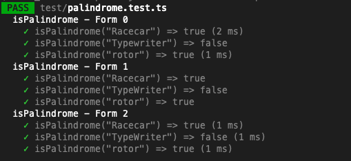

# Repeated Tests with `it.each()`

Sometimes you will have a set of tests that all look very oddly similar, but use ever so slightly different data and results. Not to worry, we can write the test code once and insert our own data layout using the `it.each()` function. This will also let us use the values in the test name.


Let's say we are testing the following function, since it's fairly simple.

```typescript
// src/palindrome.ts
function isPalindrome(word: string): boolean {
	return word.toLowerCase() === word.toLowerCase().split('').reverse().join('');
}
```

  

## Form 0: Individual Tests

The default way to write a test suite is to use individual `it()` statements for each test.

```typescript
// test/palindrome.test.ts
describe('isPalindrome - Form 0', () => {
	it('isPalindrome("Racecar") => true', () => {
		expect(isPalindrome('Racecar')).toEqual(true);
	});
	it('isPalindrome("Typewriter") => false', () => {
		expect(isPalindrome('Typewriter')).toEqual(false);
	});
	it('isPalindrome("rotor") =>', () => {
		expect(isPalindrome('rotor')).toEqual(true);
	});
});
```

This certainly works, but it violates the `DRY` principle - Don't Repeat Yourself. We can do better!

  

## Form 1: Input data as an array of Arrays

You can specify a test data suite as an "Array of Arrays" if you like, where each inner array is equal to one test data set. Example:

```typescript
// test/palindrome.test.ts
describe('isPalindrome - Form 1', () => {
	it.each([
		['Racecar', true],
		['TypeWriter', false],
		['rotor', true],
	])('isPalindrome("%s") => %s', (testWord, expectedResult) => {
		expect(isPalindrome(testWord)).toEqual(expectedResult);
	});
});
```

This gives us a few nice qualities, and has some downsides.

Firstly, we write the test code once, and yet it runs multiple times!

We also can inject the parameter values from the test into the test name (using `%s` formatting)!

It also means that adding more test cases is as easy as adding a new line to the array.

  

Unfortunately, it has the downside of not really labelling the parameters. If you're not so familiar with JS, it might not be obvious that `'Racecar'` is being inserted as `testWord`, but that's not a huge deal.

  

We do have another option:

  

## Form 2: Input Data as Tagged Template Literals

Tagged Template literals is a concept in JS of using the backtick characters (`` ` ``) to format strings.

In this case we get to create a testing table as below:

```typescript
// test/palindrome.test.ts
describe('isPalindrome - Form 2', () => {
	it.each`
		testWord        | expectedResult
		${'Racecar'}    | ${true}
		${'TypeWriter'} | ${false}
		${'rotor'}      | ${true}
	`('isPalindrome("$testWord") => $expectedResult', ({ testWord, expectedResult }) => {
		expect(isPalindrome(testWord)).toEqual(expectedResult);
	});
});
```

Note the differences between this and `Form 1`

*   `it.each([])('', ()={})` is now called like `it.each``('', () => {})`
*   The parameters in the test name are now labelled, instead of using `%s`
*   The arguments to the test are now using `({ testWord, expectedResult }) => {}` instead of `(testWord, expectedResult) => {}`
*   The columns have labels!
*   Test values are wrapped in `${}` . This is required, even for string arguments.

If you're using ES Lint and Prettier, it will even clean up the table formatting for you, so all of your columns are well aligned!

  

The final advantage is that the column order doesn't have to follow the argument order in the test parameters - the column names just have to match. ie: the following will also work!

```typescript
describe('isPalindrome - Form 2', () => {
	it.each`
		expectedResult | testWord
		${true}        | ${'Racecar'}
		${false}       | ${'TypeWriter'}
		${true}        | ${'rotor'}
	`('isPalindrome("$testWord") => $expectedResult', ({ testWord, expectedResult }) => {
		expect(isPalindrome(testWord)).toEqual(expectedResult);
	});
});
```

In any case, the results will give you tests that print out like this when you run them:



  

Using `it.each()` may not be applicable for all test input data, for example if sometimes the test should throw an `Error`.
